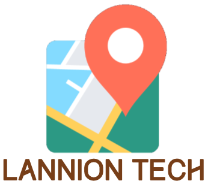

# Road Concept - A powerfull road traffic simulator !


> Projet de génie logiciel en 3ème année de formation IMR à l'ENSSAT Lannion.

## Pré-requis au projet
Pour pouvoir compiler et éxécuter le projet en local sur votre poste, les dépendances suivantes sont nécéssaires :
* [Oracle JDK8] - Le simulateur ainsi que l'API permettant d'y accéder sont développés en Java
* [Maven] - Ces deux projets utilisent le gestionaire de projet Maven
* [Docker] - 
* [Docker-compose] - 

## Comment déployer localement le projet ?

Récupérer le projet à l'aide du dépôt git hébergé sur GitHub
```sh
$ git clone git@github.com:Webrom/Road-Concept.git
```
Se placer dans le dossier ```developper-bin```
```sh
$ cd developper-bin/
```
Lancer le deamon Docker. La commande dépends de votre système d'exploitation.

Lancer le script de déploiement du projet :
```sh
$ ./updateAndDeployDocker.sh
```

Cette commande va lalancer les conteneurs suivants :
* Un serveur ```mongodb```, écoutant sur le port ```"27017```
* Un serveur ```postgresql```, écoutant sur le port ```5432```
* Un serveur HTTP ```Vert.x```, écoutant sur le port ```8080```
    
[Documentation API] La documentation de l'API est disponible sur ```http://localhost:8080/doc```

L'administrateur par défaut de l'application est :
```
admin@enssat.fr
admin
```

Si vous souhaitez supprimer les données de persistance de vos conteneurs Docker :
```sh
$ rm - rf ../Docker/mongodb/data;
$ rm - rf ../Docker/postgresql/data
```

Pour supprimer définitivement les conteneurs et images Docker associés au projet :
```sh
$ ./dockerRemoveAll.sh
```

**Free Software, Hell Yeah!**

[//]: # (These are reference links used in the body of this note and get stripped out when the markdown processor does its job. There is no need to format nicely because it shouldn't be seen. Thanks SO - http://stackoverflow.com/questions/4823468/store-comments-in-markdown-syntax)


   [Maven]: <https://maven.apache.org/>
   [Oracle JDK8]: <http://www.oracle.com/technetwork/java/javase/downloads/jdk8-downloads-2133151.html>
   [MongoDB]: <https://www.mongodb.com/>
   [Documentation API]: <http://localhost:8080/doc/>
